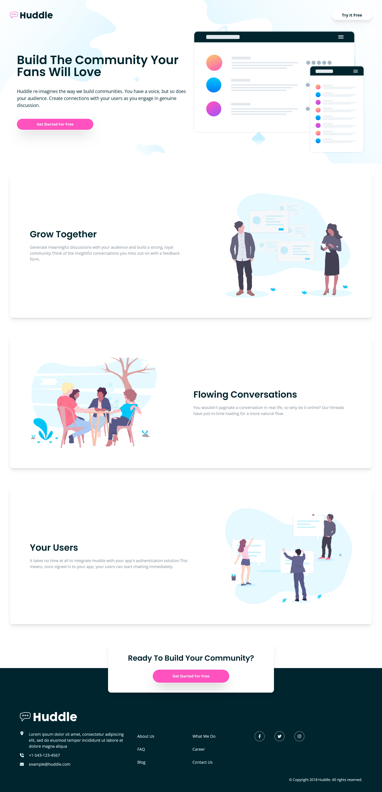
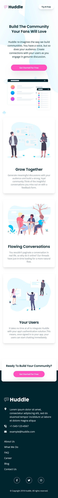

# Frontend Mentor - Huddle landing page with alternating feature blocks solution

This is a solution to the [Huddle landing page with alternating feature blocks challenge on Frontend Mentor](https://www.frontendmentor.io/challenges/huddle-landing-page-with-alternating-feature-blocks-5ca5f5981e82137ec91a5100).

## Table of contents

- [Overview](#overview)
  - [The challenge](#the-challenge)
  - [Screenshot](#screenshot)
  - [Links](#links)
- [My process](#my-process)
  - [Built with](#built-with)
  - [What I learned](#what-i-learned)
- [Author](#author)

## Overview

### The challenge

Users should be able to:

- View the optimal layout for the site depending on their device's screen size
- See hover states for all interactive elements on the page

### Screenshot

### Screenshot - Desktop View

### Screenshot - Mobile View

### Links

- Solution URL: [Frontend Mentor](https://www.frontendmentor.io/solutions/huddle-landing-page-with-tailwindcss-and-react-_xL9DO24lu)
- Live Site URL: [GitHub Pages](https://achinthyadulshan.github.io/huddle-landing-page/)

## My process

### Built with

- Semantic HTML5 markup
- Flexbox
- CSS Grid
- [Tailwind CSS](https://tailwindcss.com/)
- [React](https://reactjs.org/)
- [Vite](https://vitejs.dev/)
- [Framer Motion](https://motion.dev/)
- Desktop-first workflow

### What I learned

- Throuh this project I learned how to deal with the framer motion and Jsx. 
- I added more customization and generalization to tailwind css with respect to the previous projects. 

## Author

- Website - [Achinthya Dulshan](https://achinthyadulshan.github.io/portfolio/)
- Frontend Mentor - [@AchinthyaDulshan](https://www.frontendmentor.io/profile/AchinthyaDulshan)
- LinkedIn - [Achinthya Dulshan](https://www.linkedin.com/in/achinthya-dulshan-6a0616221/)
- X - [@Achi_Dulshan](https://x.com/Achi_Dulshan)
